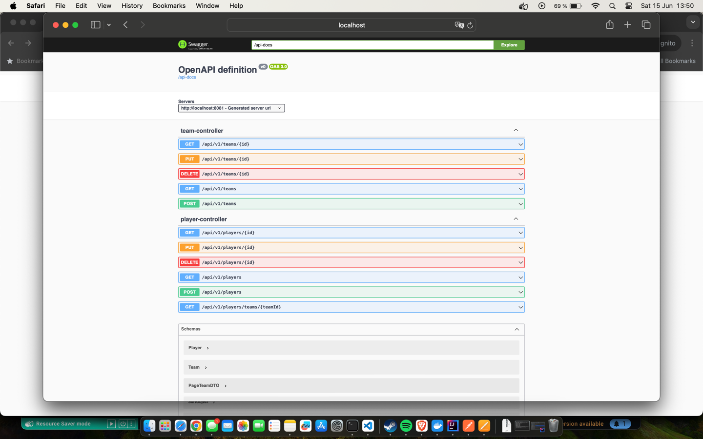
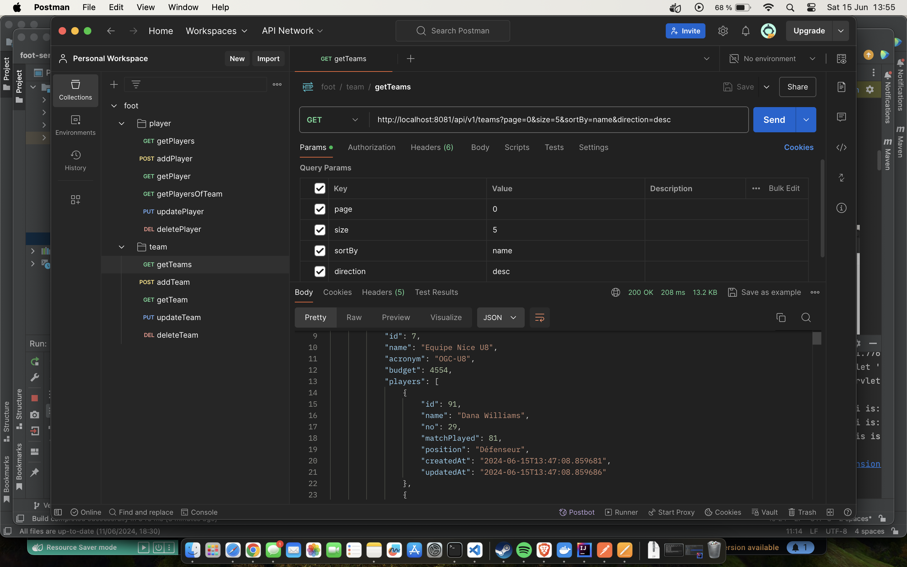

# 1- Installation
- Etape 1 : 
  - Cloner le projet : ```git clone https://github.com/kevindubuche/foot.git```
- Etape 2 :
  - Lancer le projet directement dans votre IDE préféré
  - Ou le lancer dans un container docker (si vous avez docker installé):
    - Se mettre à la racine du projet
    - Exécuter : ```mvn clean package```
    - Exécuter : ```docker-compose build```
    - Exécuter : ```docker-compose up```
    - Vous pouvez tester les endpoints (au port 8081) dans Postman (la collection foot.postman_collection.json est ici) :
      - http://localhost:8081/api/v1/teams
      - http://localhost:8081/api/v1/player
      - ou via le swagger : http://localhost:8081/swagger-ui/index.html
      - ou via les http files (dans rest-client)


# 2- Architecture & choix technique
Le choix d’une architecture 3/3 en micro service a été fait ici par soucis de simplicité et d'efficacité (on pourrait le coupler avec une architecture en microservice pour faciliter l’isolation de chaque module et aussi leur potentielle évolution; mais le contexte est simple  donc pas la peine de prendre un marteau pour écraser une mouche).

On a 3 blocs:
- D’un côté on le client qui effectue des appels vers les endpoints de notre API
- D’un autre côté, le bloc contenant les logiques métiers est divisé en 2 services : Player et Team. Ou les données/requêtes  envoyées par le client sont un client sont traitées sur notre serveur d’application au niveau de nos contrôleurs et services.
- Et enfin, la base de données ou les informations seront persistées. Ici on utilise une BDD en mémoire, en l'occurrence H2. On pourrait utiliser un autre type de BDD, mais pour faire simple et tout embarquer dans cette exercice, on utilise le H2. Si toutefois on veut changer, on n’aura qu’à ajouter le driver pour la BDD voulu et changer les configurations.

# 3- Commentaires /Javadoc / Logs
- Dans l'intégralité du projet les conventions REST sont respectées (c’est le minimum)
- Une cohérence de code est notable : nom de variables et de méthodes TRÈS TRÈS explicites et compréhensibles et respectant la même nomenclature (camelCase). Donc il peut y avoir des commentaires uniquement pour les cas atypiques et un peu complexes.
- De plus, une collection Postman (foot.postman_collection.json) vous est fournie pour faciliter les tests
- Enfin, vous pourrez aussi vous amuser avec le Swagger 🙂 (http://localhost:8081/swagger-ui/index.html)





# 4- Tests unitaires et tests d’intégration.
- Une batterie de tests de tous les endpoints peut être faite via la collection Postman que vous pouvez télécharger dans cette repo (foot.postman_collection.json)
- Chaque méthode est testée unitairement
- Tous les appels métiers sont testés et TOUTES les contraintes sont respectées

# 5- Choix techniques en détails
- Git pour le versioning
- Java 17 (ce n’est pas la dernière version mais je préfère travailler avec une version LTS que toute la communauté des dev jugé “stable” 😀
- Spring Boot 3.3.0
- Maven pour la gestion des dépendance et pour le build
- https://start.spring.io/ est le point de départ de mes projets Spring Boot et voici la liste de mes dépendances (et pourquoi) :
  - foot-service : Spring web, Lombok (pour éviter trop de code pour tout ce qui est constructeur, getter et setter),  Spring Data JPA, H2 Database

## 5.1- Liste des endpoints:


| URL                                                                          | ACTION | Description                                                                 |
|:-----------------------------------------------------------------------------|:-------|:----------------------------------------------------------------------------|
| http://localhost:8081/api/v1/players                                         | GET    | Récupérer la liste de tous les joueurs. On peut filtrer, trier et paginer   |
| http://localhost:8081/api/v1/players                                         | POST   | Enregistrer un joueur                                                       |
| http://localhost:8081/api/v1/players/{player-id}                             | GET    | Récupérer un joueur à partir de son id                                      |
| http://localhost:8081/api/v1/players/teams/{team-id}                         | GET    | Récupérer tous les joueurs d'une équipe (id de l'équipe en paramètre)       |
| http://localhost:8081/api/v1/players/{player-id}                             | PUT    | Modifier un joueur                                                          |
| http://localhost:8081/api/v1/players/{player-id}                             | DELETE | Supprimer un joueur                                                         |
| http://localhost:8081/api/v1/teams                                           | GET    | Récupérer la liste de toutes les équipes. On peut filtrer, trier et paginer |
| http://localhost:8081/api/v1/teams                                           | POST   | Enregistrer une équipe (avec ou sans joueurs)                               |
| http://localhost:8081/api/v1/teams/{team-id}                                 | GET    | Récupérer une équipe                                                        |
| http://localhost:8081/api/v1/teams/{team-id}                                 | PUT    | Modifier une équipe                                                         |
| http://localhost:8081/api/v1/teams/{team-id}                                 | DELETE | Supprimer une équipe                                                        |

## 5.2- Réalisatioon
- [x] Faire une API Rest qui aura 2 méthodes (l’ajout d’autres méthodes n’est pas de refus et sera considéré comme un bonus) : 
  - [x] Une qui retournera une liste d’équipes contenant chacune une liste de joueurs. 
  - [x] La liste sera paginée et pourra être triée côté serveur (tri sur nom d’équipe, acronyme et budget).
  - [x] Une autre qui permettra d’ajouter une équipe avec ou sans joueurs associés (tous les autres champs sont obligatoires).
- [x] Bonus :
  - [x] Toutes les opérations basiques (CRUD) peuvent être réalisées sur les endpoints /teams et /player
  - [x] Respect des conventions REST
  - [x] Utilisation des couches de Spring et des dépendances Maven au mieux 
  - [x] Utilisation des abstractions / implementations
  - [x] Documentation exhaustive (ah oui !  😀 😀)
  - [x] Gestion des exceptions et des erreurs de manière générique
  - [x] Pas d'eposition des entités métiers : utilisation et validation des DTO en input/output
  - [x] Tracer les actions (ajout date et heure de création et de mise à jour)
  - [x] Des données de test générées au lancement de l'application
- Idées d'amélioration :
  - A l'avenir, on peut penser à une isolation des modules en microservices, avec une base de donnée “dédiée”.
  - On peut (et on doit) sécuriser l'API. On peut intégrer Spring security une authentification sans état basée sur JWT. Ou plus simplement pull une image Keyclock de duckerhub (on pourrait utiliser n’importe quelle solution de gestion (authentification et autorisation) d’utilisateurs (ou peut être connecter l’application à Firebase ou un autre SSO) mais ce n'est pas le sujet central de cet exercice.
  - Par rapport au point précédent, il faut penser à gérer les rôles et les autorisations (et potentiellement des groupes)
  - Ne pas mettre les credentials dans des fichiers de configuration (notre BDD est super securisé 😀)
  - Tracer les actions en ajoutant l'utilisateur dans Auditable
  - Ne pas supprimer les données (uniquement changer son etat) : faire du soft delete

### Mot de la fin :
- N'hésitez pas à me contacter pour plus de détails/explications; d'ici là g33cker and enjoy it !